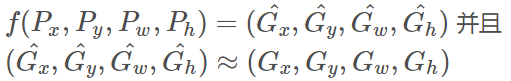
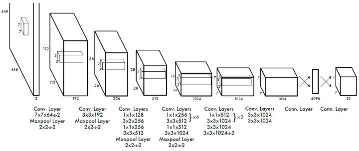
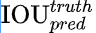

# Start-learning-object-detection
# **基本知识**

## **Sliding Window（滑窗）**

- 如果一个图片大小是200x200，我们需要检测的物体是10x10大小
- 那么第一次以图片左上角(0,0)像素为顶点取一个10x10大小的框，判断这个区域的图片是不是目标；
- 向水平(竖直)方向滑动，比如1个像素(步长自定)，再取一个10x10大小的框，判断新取出区域是不是目标；
- 如此重复直到把图片覆盖完全

在滑框过程中，考虑到相机远近产生的尺度变化，所取框的大小不应该限于一个固定值，应该根据实际情况设置多个大小的框，比如之前的例子，如果我们需要检测的最小物体是10x10， 最大物体是200x200， 那么可以在这俩个区间之间设置一些大小，如30x30， 70x70等。总结下：**滑框法其实是把检测问题转换成了图片分类问题。**

## **Selective Search（选择性搜索算法）**

论文链接：https://link.springer.com/article/10.1007/s11263-013-0620-5

参考博客：https://zhuanlan.zhihu.com/p/39927488

selective search的策略是，尽可能遍历所有的尺度，但是不同于暴力穷举，selective search先得到小尺度的区域，然后一次次合并得到大的尺寸，这样也符合人类的视觉认知。既然特征很多，那就把我们知道的特征都用上，但是同时也要照顾下计算复杂度，不然和穷举法也没啥区别了。最后还要做的是能够对每个区域进行排序，这样你想要多少个候选我就产生多少个。

选择性搜索是用于目标检测的区域提议算法，它计算速度快，具有很高的召回率，基于颜色，纹理，大小和形状兼容计算相似区域的分层分组。三个优势：

1. ) 捕捉不同尺度（Capture All Scales）
2. ) 多样化（Diversification）
3. ) 快速计算（Fast to Compute）

​    Selective Search算法主要包含两个内容：Hierarchical Grouping Algorithm、Diversification Strategies。

###  **产生多尺度的区域建议**

图像中区域特征比像素更具代表性，作者使用基于graph的图像分割算法(https://blog.csdn.net/m0_38002423/article/details/94593560)  产生图像初始区域，使用贪心算法对区域进行迭代分组:

1. ) 先根据《Efficient Graph-Based Image Segmentation》 这篇论文分割的图片画出多个框，把所有框放入列表Region中；
2. ) 根据相似程度（颜色，纹理，大小，形状等），计算Region中框之间的俩俩形似度，把相似度放入列表A中
3. ) 从列表A中找出相似度最大的俩个框a,b并且合并
4. ) 把合并的框加入列表Region中，从A中删除和a，b相关的相似度，重复步骤2，直至清空A。

最终只需要对Region中的框进行图片分类，就可以得到原图的检测结果。候选框从数十万降到几千（R-CNN中俩千左右）。

在每次迭代中，形成更大的区域并将其添加到区域提议列表中。以自下而上的方式创建从较小的细分segments到较大细分segments的区域提案。

Hierarchical Grouping Algorithm的具体操作如下图：

**输入：**图片（三通道）

**输出：**物体位置的可能结果L

1. 使用基于graph的图像分割算法到初始分割区域R={r1,r2,…,rn}；
2. 初始化相似度集合S=∅；
3. 计算两两相邻区域之间的相似度，将其添加到相似度集合S中；
4. 从集合S中找出，相似度最大的两个区域 ri 和rj，将其合并成为一个区域 rt，从集合中删去原先与ri和rj相邻区域之间计算的相似度，计算rt与其相邻区域（与ri或rj相邻的区域）的相似度，将其结果加入到相似度集合S中。同时将新区域 rt 添加到区域集合R中；
5. 获取每个区域的Bounding Boxes L，输出物体位置的可能结果L。

### **保持多样性的策略**

为了尽最大可能去分割所有情景的图片，需要得保持特征的多样性，Selective Search主要通过两种方式保持特征多样性，一方面是通过色彩空间变换，将原始色彩空间转换到多达八中的色彩空间。然后通过多样性的距离计算方式，综合颜色、纹理等所有的特征。

距离计算方式需要满足两个条件，其一速度得快，因为毕竟有这么多的区域建议还有这么多的多样性。其二是合并后的特征要好计算，因为通过贪心算法合并区域，如果每次都需要重新计算距离，这个计算量就大太多了。

#### 颜色距离

对各个通道计算颜色直方图，然后取各个对应bins的直方图最小值、

#### 纹理距离

纹理距离计算方式和颜色距离几乎一样，我们计算每个区域的快速sift特征，其中方向个数为8，3个通道，每个通道bins为10，对于每幅图像得到240维的纹理直方图，然后通过上式计算距离。

#### 优先合并小的区域

如果仅仅是通过颜色和纹理特征合并的话，很容易使得合并后的区域不断吞并周围的区域，后果就是多尺度只应用在了那个局部，而不是全局的多尺度。因此我们给小的区域更多的权重，这样保证在图像每个位置都是多尺度的在合并。

#### 区域的合适度度距离

不仅要考虑每个区域特征的吻合程度，区域的吻合度也是重要的，吻合度的意思是合并后的区域要尽量规范，不能合并后出现断崖的区域，这样明显不符合常识，体现出来就是区域的外接矩形的重合面积要大。因此区域的合适度距离定义为：

#### 综合各种距离

#### 参数初始化多样性

基于基于图的图像分割得到初始区域，而这个初始区域对于最终的影响是很大的，因此通过多种参数初始化图像分割，也算是扩充了多样性。

### **给区域打分**

通过上述的步骤我们能够得到很多很多的区域，但是显然不是每个区域作为目标的可能性都是相同的，因此我们需要衡量这个可能性，这样就可以根据我们的需要筛选区域建议个数啦。

这篇文章做法是，给予最先合并的图片块较大的权重，比如最后一块完整图像权重为1，倒数第二次合并的区域权重为2以此类推。但是当我们策略很多，多样性很多的时候呢，这个权重就会有太多的重合了，排序不好搞啊。文章做法是给他们乘以一个随机数，毕竟3分看运气嘛，然后对于相同的区域多次出现的也叠加下权重，毕竟多个方法都说你是目标，也是有理由的嘛。这样我就得到了所有区域的目标分数，也就可以根据自己的需要选择需要多少个区域了。

## **Region Proposal Net (RPN 锚点提框的机制)**

1、Input Image经过CNN特征提取，**首先**来到Region Proposal网络。由Regio Proposal Network输出的Classification，这**并不是**判定物体在COCO数据集上对应的80类中哪一类，而是输出一个Binary的值p，可以理解为p∈[0, 1]，人工设定一个threshold=0.5。

RPN网络做的事情就是，如果一个Region的 p>=0.5，则认为这个Region中可能是80个类别中的某一类，具体是哪一类现在还不清楚。到此为止，Network只需要把这些可能含有物体的区域选取出来就可以了，这些被选取出来的Region又叫做ROI （Region of Interests），即感兴趣的区域。当然了，**RPN同时也会在feature map上框定这些ROI感兴趣区域的大致位置，即输出Bounding-box**。

有个很重要的概念：锚点。理解RPN的关键也就在锚点上。锚点，字面理解就是标定位置的固定的点。在提框机制中，是预先设定好一些固定的点(anchor)和框(anchor box)的意思。图示一下：

如上图，假设在原来的图像上设定4个锚点(2x2)，那么原图就可以看作分成2x2的格子，每个格子的中心叫做一个锚点。以锚点为中心，给定两个宽高比(1:2, 2:1)，确定一个宽度或者高度(100px)，画两个框，绿色和红色的框就是锚点框(anchor box)。也就是说，我们看作每一个锚点都可以产生俩个锚点框，这些框就是固定在这里存在的，不会变也不会动。

当模型输出的预测位置是棕色虚线框的时候，计算预测框和每一个锚点框的误差，方法是：首先用bounding box regression的方法计算每一个anchor box 到真值框的 $t_*: (t_x, t_y, t_w, t_h)$，一种scale的anchor box需要一个bounding box regressor; 再计算预测框到每一个anchor box的偏移量$t_*'$，最后使$loss = s,ppth_{L1}(t_*-t_x')$ 最小。

到这里可能会产生一个问题，为什么不直接计算预测框和真值框的误差，而是要通过anchor作为中间传导呢？这和模型的输出有关系，RPN的输出位置信息并不是框的位置 $(x, y, w h)$，而是**每一个锚点框的偏移量**$t_*'$ 。因此需要学习$t_*$和$t_*'$的误差最小。

拿上面的图示例子，全图共4个锚点，每个锚点产生2个锚点框，所以一张图产生4×2=8个锚点框，RPN的输出是对每一个锚点框输出一个种类(前景后景)置信度和一个位置偏移量$t_*'$  ，共8×(2+4)个值

**其实RPN最终就是在原图尺度上，设置了密密麻麻的候选Anchor。然后用cnn去判断哪些Anchor是里面有目标的positive anchor，哪些是没目标的negative anchor。所以，仅仅是个二分类而已！**

## **非极大值抑制算法（Non Maximum Suppression, NMS）**

参考博客：https://blog.csdn.net/shuzfan/article/details/52711706

由于滑动窗口，同一个人可能有好几个框(每一个框都带有一个分类器得分)

而我们的目标是一个人只保留一个最优的框：

**于是我们就要用到非极大值抑制，来抑制那些冗余的框：** 抑制的过程是一个迭代-遍历-消除的过程。

**（1）**将所有框的得分排序，选中最高分及其对应的框：

**（2）**遍历其余的框，如果和当前最高分框的重叠面积(IOU)大于一定阈值，我们就将框删除。

**（3）**从未处理的框中继续选一个得分最高的，重复上述过程。

## **Bounding Box Regression(边框回归)**

参考博客：https://blog.csdn.net/zijin0802034/article/details/77685438/

### **为什么要边框回归？**

对于上图，绿色的框表示Ground Truth, 红色的框为Selective Search提取的Region Proposal。那么即便红色的框被分类器识别为飞机，但是由于红色的框定位不准(IoU<0.5)， 那么这张图相当于没有正确的检测出飞机。 如果我们能对红色的框进行微调， 使得经过微调后的窗口跟Ground Truth 更接近， 这样岂不是定位会更准确。 确实，Bounding-box regression 就是用来微调这个窗口的。

### **边框回归是什么？**

对于窗口一般使用四维向量(x,y,w,h)来表示， 分别表示窗口的中心点坐标和宽高。 对于下图, 红色的框 P 代表原始的Proposal, 绿色的框 G 代表目标的 Ground Truth， 我们的目标是寻找一种关系使得输入原始的窗口 P 经过映射得到一个跟真实窗口 G 更接近的回归窗口G^。

边框回归的目的既是：给定(Px,Py,Pw,Ph)(Px,Py,Pw,Ph)寻找一种映射f， 使得：

### **边框回归怎么做的？**

那么经过何种变换才能从图 2 中的窗口 P 变为窗口G^呢？ 比较简单的思路就是: *平移+尺度放缩*

## **多通道图像卷积基础**

如图所示，输入有3个通道，同时有2个卷积核。对于每个卷积核，先在输入3个通道分别作卷积，再将3个通道结果加起来得到卷积输出。所以对于某个卷积层，无论输入图像有多少个通道，输出图像通道数总是等于卷积核数量！

对多通道图像做1x1卷积，其实就是将输入图像于每个通道乘以卷积系数后加在一起，即相当于把原图像中本来各个独立的通道“联通”在了一起。

## **focal loss**

参考博客：https://zhuanlan.zhihu.com/p/80594704

# **RCNN (2014.10)**

《Rich features hierarchies fro accurate object detection and semantic segmentation》

论文地址：https://arxiv.org/abs/1311.2524

RCNN 提出之前，主要是手工设计特征：

用CNN替代手动设计特征：

## RCNN流程图如下：

第一步是对输入的图片进行区域提取，R-CNN文中用的是selective search的方法（当然也可以用其他的），之后对每一块提取出来的区域缩放到统一的大小，输入CNN中使之输出一个Nx1的特征向量，然后用分类器（文中使用SVM，讨论了softmax的可行性）判断该区域是不是某类物体，接着分类完成之后对选出的区域做了一个**边框回归（bounding box regression）**处理得到最后的结果：物体种类和框的位置。

## 文章的贡献有二：

1. **使用CNN代替手工设计的特征提取，而且证明了不同CNN结构对检测结果同样有很大的影响。**

   ​        作者做了对比实验，发现不同CNN结构提取的特征对物体检测的mAP影响非常大，VGG-16比AlexNet在VOC 2007上高了8个百分点

2. **加入了根据CNN特征的框回归方法**

   ​        对比实验表明在SVM分类的结果上做框回归之后会把mAP再提高4个百分点。

   网络的训练过程描述如下：

   - 第一步，在ImageNet上pre-train一个图片分类的CNN（也可以用别人提供的比如AlexNet）
   - 第二步，把训练好的CNN最后一个分类层换成一个新的初始化分类层，比如从AlexNet的1000 类物体换成VOC的20+1类（20个物体种类和1个背景类），继续fine tune训练
   - 第三步，针对每一类目标物体训练一个one vs rest的SVM
   - 第四步，使用CNN的输出做输入，训练一组参数做bounding-box regressor修正位置

R-CNN的作者认为，CNN输出的特征向量里其实是包含了一定的位置信息的，所以他们在CNN输出的特征向量上做了一个loss计算，调整原来框的位置（相当于是对原来的框加上缩放和平移操作）。个人认为也可以理解，人在看一个框是否正确时会说大了，小了，向左偏了之类的评价，CNN输出的特征也可以认为提的是向左偏了一点的特征，大了的特征等，所以**每一个种类都需要设计一个bounding box regressor**，只要设计一个好的loss函数，能学习到一组参数使loss收敛就可以啊。因此，loss的设计是关键。

还是从最直观想法开始，一个物体预测框的位置表示是 (Px, Py, Pw, Ph)，位置的真值ground truth是 (Gx, Gy, Gw, Gh)， 这种损失函数可以用L1，L2，就看看用L2loss之后会发生什么吧？

若检测结果如下图：

同一个图上有俩个人，绿色框是真值框，红色框是预测框，我们规定IoU>0.8是正确预测（貌似有点严格，只是为了说明问题），明显的大框的预测是对的，小框的预测是错的。但是，此时用L2 loss去计算俩个预测框的损失，确有可能得到同样的值，假设是 L1 ，因为在图中肉眼观测框的左上角点偏离的像素相似，宽高也相似。这样相当于是**对于同一个种类的大物体和小物体判断预测值损失的尺度不同**，那么模型就会迷惑，因为输入都是缩放到同样大小的图片，对于loss是 L1 的特征，俩个预测结果一个对一个错，应该怎样更新参数呢？这样就无法给出一个好的学习结果。（L1loss有同样的问题）

为了解决这个问题，保证尺度不变性。R-CNN没有直接学习 x, y, w, h 的数值，而是学习了比例。真值框和预测框的宽高比是一个大于0的值，CNN的输出却无法保证大于0，所以表示宽高比为指数函数的形式：

其中 e^d_w(P) 和  e^d_h(P) 分别是宽高的缩放比例。角点的平移误差为：

学习的目标是其中的比例：

R-CNN论文中学习框回归的输入是AlexNet中第五个pooling层输出的特征，论文中表示为 , 参数 是可学习的，损失函数就定义为：

R-CNN是一篇非常厉害的文章，引进了CNN做特征提取，给出了完善的训练方法，显著提高物体检测准确率，探索用softmax直接代替SVM的可能性，并且完善了框回归机制。同样也有缺点，训练需要分好几段，很多中间结果占很大硬盘空间，训练时间长，测试时间也很长，VGG-16在GPU(不知道什么型号)上需要跑47s才能处理一帧。

# **SPP Net  (2015.04)**

《Spatial Pyramid Pooling in Deep Convolutional Networks for Visual Recognition》

论文地址：https://arxiv.org/abs/1406.4729

参考博客：https://blog.csdn.net/v1_vivian/article/details/73275259

R-CNN中分类是用全连接层实现的，所以要求输入的图片尺寸必须固定。所以，每一个region都会被缩放到同样的大小，单独送入CNN中进行特征提取。因此selective search如果产生俩千个候选框，那就需要用CNN提取俩千次特征。于是很多聪明人就在想，有没有办法对所有的候选框都只进行一次CNN特征提取的计算？SPP Net可以做到。

SPP Net主要添加了一个SPP(spatial pyramid pooling)层，这一层可以对不同大小的图片产生固定长度的特征向量。用原论文中的图解释最清楚：

图中的意思是，对于不同尺寸的输入图片A和B，到SPP层时的输入分别是：$1×256×h_A*w_A$ 和 $1×256×h_B*w_B$ （1指batch_size=1, 256指通道数，h, w分别是高和宽），不管A和B的特征图宽高是多少，在特征图上划4X4, 2X2, 1X1的格子，对这些格子里的像素进行pooling操作，最后把三个尺度的输出contact到一起，组成一个特征向量做分类。这样无论输入的图像是多大，都可以有一个固定长度的特征向量。因此，SPP Net对一张图片进行一次特征提取，根据感受野的传递，在特征图上找出候选框对应的区域，把那一块单独提出来输入spp层，产生特征向量做分类。

特别说明一下，一次对整张图提取CNN，根据感受野找到候选框对应的特征和把候选框扣出来再用CNN提特征得到的**俩种特征是不同的**，但是都可以用来做分类。有个更清楚的流程总结：

这个方法也有**缺点**，不能进行反向传播，所以训练的时候分别训练前半段网络和后面的FC层，使训练步骤更复杂。不能反向传播的原因一度困扰着我，一个pooling操作，为什么就不能回传了？主要还是这个pyramid的问题，特征图被分为4x4, 2x2, 1x1三个层级，每个层级的pooling层都能回传，只是这三个在回传之后要怎样融合到一起？简单相加也没有依据，所以不能进行反向传播。

SPP Net的设计让特征提取的时间成百上千倍的加快，缺点就是训练步骤麻烦。

# **Fast RCNN (2015.09)**

论文地址：https://arxiv.org/abs/1504.08083

Fast R-CNN 主要在训练步骤上做了优化，主要是俩个方面： 根据SPPNet 中的spp层改进设计了RoI Pooling，使用muti-task loss同时训练物体种类和位置。

之前提到spp层不能进行反向传播，是由于金字塔的结构，Fast R-CNN就化用了SPPNet的方法，使用RoI Pooling，其实就是只用spp中金字塔的一层做池化，这样也能产生固定长度的特征向量，用来做分类。而且只用金字塔的一层做池化，就是一个池化操作了，那就可以做反向传播了。

在Fast R-CNN之前的网络，如R-CNN，SPP Net，在训练时都需要训练一个SVM做分类最后接一个bounding box regressor调整框的位置。继R-CNN探讨过去掉SVM直接用softmax分类的可能性之后，这篇文章做了实践。分类和框回归一起做，叫做multi-task loss。分类直接在原来CNN的基础上加入FC层和softmax即可; 框回归是让CNN的输出直接是bounding box regressor需要的4个比例，偏移量： $t_*:(t_x, t_y, t_w, t_h)$（见2.1），损失函数是smooth L1， 文章中用 $L_loc$ 表示框回归的损失：

文中解释，用smooth L1是因为相比L2 loss，L1对异常值outlier更不敏感。

Fast R-CNN总结一下就是：前面Selective Search提取框的过程配上后面的CNN+softmax，以现在的眼光去比喻，有点像造好了一辆汽车(CNN)，但是在用马(selective search)拉着跑的感觉。因为selective search的计算过程就挺慢的，想让物体检测达到实时，就得改造候选框提取的方法。

# **Faster RCNN (2016.01)**

论文地址：https://arxiv.org/abs/1506.01497

代码地址：https://github.com/jwyang/faster-rcnn.pytorch

参考博客;https://zhuanlan.zhihu.com/p/31426458

代码导读：https://zhuanlan.zhihu.com/p/145842317

 设计成end2end的网络

Faster RCNN其实可以分为4个主要内容：

1. Conv layers。作为一种CNN网络目标检测方法，Faster RCNN首先使用一组基础的conv+relu+pooling层提取image的feature maps。该feature maps被共享用于后续RPN层和全连接层。
2. Region Proposal Networks。RPN网络用于生成region proposals。该层通过softmax判断anchors属于positive或者negative，再利用bounding box regression修正anchors获得精确的proposals。
3. Roi Pooling。该层收集输入的feature maps和proposals，综合这些信息后提取proposal feature maps，送入后续全连接层判定目标类别。
4. Classification。利用proposal feature maps计算proposal的类别，同时再次bounding box regression获得检测框最终的精确位置。

上图表示了python版本中的VGG16模型中的faster_rcnn_test.pt的网络结构，可以清晰的看到该网络对于一副任意大小PxQ的图像：

- 首先缩放至固定大小MxN，然后将MxN图像送入网络；
- 而Conv layers中包含了13个conv层+13个relu层+4个pooling层；
- RPN网络首先经过3x3卷积，再分别生成positive anchors和对应bounding box regression偏移量，然后计算出proposals；
- 而Roi Pooling层则利用proposals从feature maps中提取proposal feature送入后续全连接和softmax网络作classification（即分类proposal到底是什么object）。

先输入一个图像image，用一个CNN提特征，在这段CNN输出的特征图(feature map)上做anchor处理，如上图所示，假设这个层级的特征图通道数是256。那么这个特征图多大，就相当于设定了多少个锚点，比如特征图长宽是13x13, 那就有169个锚点，每一个锚点按照论文中的说法可以产生9个锚点框，这9个锚点框共用一组1×256的特征，即锚点所在位置上所有通道的数据，接一个1×1的卷积核控制维度，做位置回归和前后景判断，这就是RPN的输出。在RPN的输出基础上，对所有anchor box的前景置信度排序，挑选出前top-N的框作为预选框proposal， 继续用一段CNN做进一步特征提取，最后再进行位置回归和物体种类判断。

那么这9个anchors是做什么的呢？借用Faster RCNN论文中的原图，如图7，遍历Conv layers计算获得的feature maps，为每一个点都配备这9种anchors作为初始的检测框。这样做获得检测框很不准确，不用担心，后面还有2次bounding box regression可以修正检测框位置。

Faster R-CNN的训练方法有好几种，主要分为分段训练和端到端训练。分段：先训练RPN，从所有anchor box中随机挑选256个，保持正样本负样本比例1：1(正样本不够时用负样本补)；再从RPN的输出中，降序排列所有anchor box的前景置信度，挑选top-N个候选框叫做proposal, 做分类训练。

**总结一下**：Faster R-CNN设计了一个region proposal 网络，在提取特征的过程中完成候选框提取的操作，大大加快了物体检测的速度。

# **Mask RCNN**

# **YOLO（2016.03）**

《You Only Look Once》

论文地址：https://arxiv.org/abs/1506.02640

参考博客：（1）https://zhuanlan.zhihu.com/p/25236464

​			  	（2）https://zhuanlan.zhihu.com/p/32525231

​				  （3）https://blog.csdn.net/u010167269/article/details/52638771

YOLO将检测变为一个 regression problem，YOLO 从输入的图像，仅仅经过一个 neural network，直接得到 bounding boxes 以及每个 bounding box 所属类别的概率。正因为整个的检测过程仅仅有一个网络，所以它可以直接 end-to-end 的优化。YOLO 结构十分的快，标准的 YOLO 版本每秒可以实时地处理 45 帧图像。一个较小版本：Fast YOLO，可以每秒处理 155 帧图像，它的 mAP（mean Average Precision） 依然可以达到其他实时检测算法的两倍。同时相比较于其他的 state-of-art detection systems。尽管 YOLO 的定位更容易出错，这里的 定位出错，即是指 coordinate errors。但是 YOLO 有更少的 false-positive，文章这里提到了一个词：background errors，背景误差。这里所谓的 背景误差 即是指 False Positive（（假正, FP）被模型预测为正的负样本）。

Yolo算法不再是窗口滑动了，而是直接将原始图片分割成互不重合的小方块，然后通过卷积最后生产这样大小的特征图，基于上面的分析，可以认为特征图的每个元素也是对应原始图片的一个小方块，然后用每个元素来可以预测那些中心点在该小方格内的目标，这就是Yolo算法的朴素思想。

Yolo的CNN网络将输入的图片分割成S*S网格，然后每个单元格负责去检测那些中心点落在该格子内的目标，如图所示，可以看到狗这个目标的中心落在左下角一个单元格内，那么该单元格负责预测这个狗。每个单元格会预测 B个边界框（bounding box）以及边界框的置信度（confidence score）。所谓置信度其实包含两个方面，一是这个边界框含有目标的可能性大小，二是这个边界框的准确度。前者记为Pr(object)，当该边界框是背景时（即不包含目标），此时 Pr(object)=0。而当该边界框包含目标时，Pr(object)=1。边界框的准确度可以用预测框与实际框（ground truth）的IOU（intersection over union，交并比）来表征，记为 $IOU_{pred}^{truth}$。因此置信度可以定义为 $P_r(object) * IOU_{pred}^{truth}$。很多人可能将Yolo的置信度看成边界框是否含有目标的概率，但是其实它是两个因子的乘积，预测框的准确度也反映在里面。边界框的大小与位置可以用4个值来表征：(x, y, w, h) ，其中 (x, y)是边界框的中心坐标，而 w 和 h 是边界框的宽与高。还有一点要注意，中心坐标的预测值 (x, y) 是相对于每个单元格左上角坐标点的偏移值，并且单位是相对于单元格大小的，单元格的坐标定义如图6所示。而边界框的 w 和 h 预测值是相对于整个图片的宽与高的比例，这样理论上4个元素的大小应该在 [0, 1] 范围。这样，每个边界框的预测值实际上包含5个元素：(x, y, w, h, c) ，其中前4个表征边界框的大小与位置，而最后一个值是置信度。

还有分类问题，对于每一个单元格其还要给出预测出 C 个类别概率值，其表征的是由该单元格负责预测的边界框其目标属于各个类别的概率。但是这些概率值其实是在各个边界框置信度下的条件概率，即 。值得注意的是，不管一个单元格预测多少个边界框，其只预测一组类别概率值，这是Yolo算法的一个缺点，在后来的改进版本中，Yolo9000是把类别概率预测值与边界框是绑定在一起的。同时，我们可以计算出各个边界框类别置信度（class-specific confidence scores）:

边界框类别置信度表征的是**该边界框中目标属于各个类别的可能性大小以及边界框匹配目标的好坏**。后面会说，一般会**根据类别置信度来过滤网络的预测框**。

总结一下，每个单元格需要预测  (B×5+C) 个值。如果将输入图片划分为 S×S 网格，那么最终预测值为 S×S×(B×5+C)大小的张量。整个模型的预测值结构如下图所示。对于PASCAL VOC数据，其共有20个类别，如果使用 S=7, B=2，那么最终的预测结果就是 7×7×30 大小的张量。在下面的网络结构中我们会详细讲述每个单元格的预测值的分布位置。

(1) 给个一个输入图像，首先将图像划分成7 * 7的网格。

(2) 对于每个网格，每个网格预测2个bouding box（每个box包含5个预测量）以及20个类别概率，总共输出7×7×（2*5+20）=1470个tensor

(3) 根据上一步可以预测出7 * 7 * 2 = 98个目标窗口，然后根据阈值去除可能性比较低的目标窗口，再由NMS去除冗余窗口即可。

## 网络设计

Yolo采用卷积网络来提取特征，然后使用全连接层来得到预测值。网络结构参考GooLeNet模型，包含24个卷积层和2个全连接层，如下图所示。对于卷积层，主要使用1x1卷积来做channle reduction，然后紧跟3x3卷积。对于卷积层和全连接层，采用Leaky ReLU激活函数： max(x, 0.1x)。但是最后一层却采用线性激活函数。

可以看到网络的最后输出为7×7×30 大小的张量。这和前面的讨论是一致的。这个张量所代表的具体含义如下图所示。对于每一个单元格，前20个元素是类别概率值，然后2个元素是边界框置信度，两者相乘可以得到类别置信度，最后8个元素是边界框的 （x, y, w, h）。大家可能会感到奇怪，对于边界框为什么把置信度 c 和（x, y, w, h）都分开排列，而不是按照 （x, y, w, h, c） 这样排列，其实纯粹是为了计算方便，因为实际上这30个元素都是对应一个单元格，其排列是可以任意的。但是分离排布，可以方便地提取每一个部分。这里来解释一下，首先网络的预测值是一个二维张量 P ，其shape为 [batch, 7×7×30] 。采用切片，那么  就是类别概率部分，而 是置信度部分，最后剩余部分 是边界框的预测结果。这样，提取每个部分是非常方便的，这会方面后面的训练及预测时的计算。

## 网络设计

在训练之前，先在ImageNet上进行了预训练，其预训练的分类模型采用网络结构图中前20个卷积层，然后添加一个average-pool层和全连接层。预训练之后，在预训练得到的20层卷积层之上加上随机初始化的4个卷积层和2个全连接层。由于检测任务一般需要更高清的图片，所以将网络的输入从224x224增加到了448x448。整个网络的流程如下图所示：

下面是训练损失函数的分析，Yolo算法将目标检测看成回归问题，所以采用的是均方差损失函数。但是对不同的部分采用了不同的权重值。首先区分定位误差和分类误差。对于定位误差，即边界框坐标预测误差，采用较大的权重 λ_cord=5。然后其区分不包含目标的边界框与含有目标的边界框的置信度，对于前者，采用较小的权重值  λ_noobj=5 。其它权重值均设为1。然后采用均方误差，其同等对待大小不同的边界框，但是实际上较小的边界框的坐标误差应该要比较大的边界框要更敏感。为了保证这一点，将网络的边界框的宽与高预测改为对其平方根的预测，即预测值变为  。

另外一点，由于每个单元格预测多个边界框。但是其对应类别只有一个。那么在训练时，如果该单元格内确实存在目标，那么只选择与ground truth的IOU最大的那个边界框来负责预测该目标，而其它边界框认为不存在目标。这样设置的一个结果将会使一个单元格对应的边界框更加专业化，其可以分别适用不同大小，不同高宽比的目标，从而提升模型性能。大家可能会想如果一个单元格内存在多个目标怎么办，其实这时候Yolo算法就只能选择其中一个来训练，这也是Yolo算法的缺点之一。要注意的一点时，对于不存在对应目标的边界框，其误差项就是只有置信度，坐标项误差是没法计算的。而只有当一个单元格内确实存在目标时，才计算分类误差项，否则该项也是无法计算的。

综上讨论，最终的损失函数计算如下:

其中第一项是边界框中心坐标的误差项， 指的是第 i个单元格存在目标，且该单元格中的第 j 个边界框负责预测该目标。第二项是边界框的高与宽的误差项。第三项是包含目标的边界框的置信度误差项。第四项是不包含目标的边界框的置信度误差项。而最后一项是包含目标的单元格的分类误差项， 指的是第 i个单元格存在目标。这里特别说一下置信度的target值 Ci，如果是不存在目标，此时由于Pr(object)=0，那么 Ci = 0。如果存在目标，Pr(object)=1，此时需要确定 ，当然你希望最好的话，可以将IOU取1，这样  Ci = 1，但是在YOLO实现中，使用了一个控制参数rescore（默认为1），当其为1时，IOU不是设置为1，而就是计算truth和pred之间的真实IOU。不过很多复现YOLO的项目还是取 Ci=1，这个差异应该不会太影响结果吧。

## 网络预测

在说明Yolo算法的预测过程之前，这里先介绍一下非极大值抑制算法（non maximum suppression, NMS），这个算法不单单是针对Yolo算法的，而是所有的检测算法中都会用到。Yolo预测过程也需要用到NMS算法。

下面就来分析Yolo的预测过程，这里我们不考虑batch，认为只是预测一张输入图片。根据前面的分析，最终的网络输出是 7×7×30，但是我们可以将其分割成三个部分：类别概率部分为 [ 7, 7, 20]，置信度部分为[ 7, 7, 2]， 而边界框部分为  [ 7, 7, 2, 4]（对于这部分不要忘记根据原始图片计算出其真实值）。然后将前两项相乘（矩阵[ 7, 7, 20] 乘以[ 7, 7, 2]可以各补一个维度来完成 [ 7, 7, 1, 20]×[ 7, 7, 2, 1] )可以得到类别置信度值为 [ 7, 7, 2, 20] ，这里总共预测了 7×7×2=98 个边界框。

所有的准备数据已经得到了，那么我们先说第一种策略来得到检测框的结果，我认为这是最正常与自然的处理。首先，对于每个预测框根据类别置信度选取置信度最大的那个类别作为其预测标签，经过这层处理我们得到各个预测框的预测类别及对应的置信度值，其大小都是 [7, 7, 2]。一般情况下，会设置置信度阈值，就是将置信度小于该阈值的box过滤掉，所以经过这层处理，剩余的是置信度比较高的预测框。最后再对这些预测框使用NMS算法，最后留下来的就是检测结果。一个值得注意的点是NMS是对所有预测框一视同仁，还是区分每个类别，分别使用NMS。Ng在deeplearning.ai中讲应该区分每个类别分别使用NMS，但是看了很多实现，其实还是同等对待所有的框，我觉得可能是不同类别的目标出现在相同位置这种概率很低吧。

上面的预测方法应该非常简单明了，但是对于Yolo算法，其却采用了另外一个不同的处理思路（至少从C源码看是这样的），其区别就是先使用NMS，然后再确定各个box的类别。其基本过程如图所示。对于98个boxes，首先将小于置信度阈值的值归0，然后分类别地对置信度值采用NMS，这里NMS处理结果不是剔除，而是将其置信度值归为0。最后才是确定各个box的类别，当其置信度值不为0时才做出检测结果输出。这个策略不是很直接，但是貌似Yolo源码就是这样做的。Yolo论文里面说NMS算法对Yolo的性能是影响很大的，所以可能这种策略对Yolo更好。但是我测试了普通的图片检测，两种策略结果是一样的。

# **YOLOv2(2016.12)**

《YOLO9000: Better, Faster, Stronger》

论文地址：https://arxiv.org/abs/1612.08242

参考博客：（1）https://www.cnblogs.com/gujiangtaoFuture/articles/12172419.html

（2）https://blog.csdn.net/Jesse_Mx/article/details/53925356

YOLOv1对于bounding box的定位不是很好，在精度上比同类网络还有一定的差距，所以YOLOv2对于速度和精度做了很大的优化，并且吸收了同类网络的优点，一步步做出尝试。

YOLO V2在V1基础上做出改进后提出。其受到Faster RCNN方法的启发，引入了anchor。同时使用了K-Means方法，对anchor数量进行了讨论，在精度和速度之间做出折中。并且修改了网络结构，去掉了全连接层，改成了全卷积结构。在训练时引入了世界树（WordTree）结构，将检测和分类问题做成了一个统一的框架，并且提出了一种层次性联合训练方法，将ImageNet分类数据集和COCO检测数据集同时对模型训练。

## 2.1更准

1. **batch normalization**

   ​	YOLOv2对每批数据都做了一个归一化预处理。通过在每一个卷积层后添加**batch normalization**，极大的改善了收敛速度同时减少了对其它正则方法的依赖（舍弃了dropout优化后依然没有过拟合），使得mAP获得了2%的提升。

2. **High Resolution Classifier.** 

   ​	YOLOv1在分辨率为224×224的图片上进行预训练，在正式训练时将分辨率提升到448×448，这需要模型去适应新的分辨率。但是YOLOv2是直接使用448×448的输入，随着输入分辨率的增加，模型提高了4%的mAP.

3. **Convolutional With Anchor Boxes.** 

   ​	在预测框的数量上，由于YOLOv2将网络的输入分辨率调整到416×416，保证为多次卷积后，下采样率为32，得到13×13的特征图（feature map）。在这上面使用9种anchor boxes，得到13×13×9=1521个，这比YOLOv1大多了。

   ​	YOLOv1利用全连接层的数据完成边框的预测，会导致丢失较多的空间信息，使定位不准。在YOLOv2中作者借鉴了Faster R-CNN中的anchor思想，来改善全连接层带来的影响。Anchor是RPN（region proposal network）网络在Faster R-CNN中的一个关键步骤，是在卷积特征图上进行滑窗操作，每一个中心可以预测9种不同大小的候选框。

   ​	为了引入anchor boxes来预测候选框，作者在网络中去掉了全连接层。并去掉了最后的一个池化层以确保输出的卷积特征图有更高的分辨率。然后，通过缩减网络，让图片输入分辨率为416 * 416，目的是为了让后面产生的卷积特征图宽高都为奇数，这样就可以产生一个中心框（center cell）。作者观察到，大物体通常占据了图像的中间位置，可以只用中心的一个框来预测这些物体的位置，否则就要用中间的4个格子来进行预测，这个技巧可稍稍提升效率。最后，YOLOv2使用了卷积层降采样（采样因子为32），使得输入卷积网络的416 * 416图片最终得到13 * 13的卷积特征图（416/32=13）。

   ​        没有anchor boxes的情况下，模型召回率（recall）为81%，mAP为69.5%；加入anchor boxes，模型召回率为88%，mAP为69.2%。这样看来，准确率只有小幅度的下降，而召回率则提升了7%。

4. **Dimension Clusters（维度聚类）**

   ​	在使用anchor的时候作者遇到了两个问题，第一个是anchor boxes的宽高维度往往是精选的先验框（hand-picked priors）也就是说人工选定的先验框。虽然在训练过程中网络也会学习调整框的宽高维度，最终得到准确的bounding boxes。但是，如果一开始就选择了更好的、更有代表性的先验框维度，那么网络就更容易学到准确的预测位置。

   ​	为了使网络更易学到准确的预测位置，作者使用了K-means聚类方法类训练bounding boxes，可以自动找到更好的框宽高维度。传统的K-means聚类方法使用的是欧氏距离函数，也就意味着较大的框会比较小的框产生更多的误差，聚类结果可能会偏离。为此，作者采用IOU得分作为评价标准，这样的话，误差就和框的尺度无关了，最终的距离函数为：

   $d(box, centroid) = 1-IOU(box, centroid)$

   对数据集的聚类结果如下:

   

   ​	可以看出k=5在模型复杂度与召回率之间取一个折中值。可以看到，平衡复杂度和IOU之后，最终得到k值为5，意味着作者选择了5种大小的box维度来进行定位预测，这与手动精选的box维度不同。结果中扁长的框较少，而瘦高的框更多（这符合行人的特征），这种结论如不通过聚类实验恐怕是发现不了的。

5. **Direct location prediction（直接位置预测）**

   ​	在使用anchor的时候，遇到的第二个问题是加入anchor box的模型不稳定。作者认为模型不稳定的原因来自于预测bbox的(x，y)。如下：

   

   ​	在Faster R-CNN的预测中，偏移因子，是没有限制的，因此收敛会比较慢。故我们想让每个模型预测目标附近的一个部分，论文对采用了和YOLOv1一样的方法，直接预测中心点，并使用Sigmoid函数将偏移量限制在0到1之间(这里的尺度是针对网格框)。计算公式如下：

   

   ​	bx,by,bw,bh，是预测的bbox的中心点坐标和宽高，中心点坐标的尺度是相对于网格。 如下图：

   

   ​	经过维度聚类和直接位置预测的操作，在原有的anchor boxes版本上又提升了5%的mAP。

6. Fine-Grained Features（细粒度特征）

   ​	上述网络上的修改使YOLO最终在13 * 13的特征图上进行预测，虽然这足以胜任大尺度物体的检测，但是用上细粒度特征的话，这可能对小尺度的物体检测有帮助。Faser R-CNN和SSD都在不同层次的特征图上产生区域建议（SSD直接就可看得出来这一点），获得了多尺度的适应性。这里使用了一种不同的方法，简单添加了一个转移层（ passthrough layer），这一层要把浅层特征图（分辨率为26 * 26，是底层分辨率4倍）连接到深层特征图。

   

   ​	这个转移层也就是把高低两种分辨率的特征图做了一次连结，连接方式是叠加特征到不同的通道而不是空间位置，类似于Resnet中的identity mappings。这个方法把26 * 26 * 512的特征图连接到了13 * 13 * 2048的特征图，这个特征图与原来的特征相连接。YOLO的检测器使用的就是经过扩张的特征图，它可以拥有更好的细粒度特征，使得模型的性能获得了1%的提升。（这段理解的也不是很好，要看到网络结构图才能清楚）

   ​	补充：关于passthrough layer，具体来说就是特征重排（不涉及到参数学习），前面26 * 26 * 512的特征图使用按行和按列隔行采样的方法，就可以得到4个新的特征图，维度都是13 * 13 * 512，然后做concat操作，得到13 * 13 * 2048的特征图，将其拼接到后面的层，相当于做了一次特征融合，有利于检测小目标。

7. Multi-Scale Training

   ​	原来的YOLO网络使用固定的448 * 448的图片作为输入，现在加入anchor boxes后，输入变成了416 * 416。目前的网络只用到了卷积层和池化层，那么就可以进行动态调整（意思是可检测任意大小图片）。作者希望YOLOv2具有不同尺寸图片的鲁棒性，因此在训练的时候也考虑了这一点。

   ​	不同于固定输入网络的图片尺寸的方法，作者在几次迭代后就会微调网络。没经过10次训练（10 epoch），就会随机选择新的图片尺寸。YOLO网络使用的降采样参数为32，那么就使用32的倍数进行尺度池化{320,352，…，608}。最终最小的尺寸为320 * 320，最大的尺寸为608 * 608。接着按照输入尺寸调整网络进行训练。这种机制使得网络可以更好地预测不同尺寸的图片，意味着同一个网络可以进行不同分辨率的检测任务，在小尺寸图片上YOLOv2运行更快，在速度和精度上达到了平衡。

   ​	在小尺寸图片检测中，YOLOv2成绩很好，输入为228 * 228的时候，帧率达到90FPS，mAP几乎和Faster R-CNN的水准相同。使得其在低性能GPU、高帧率视频、多路视频场景中更加适用。在大尺寸图片检测中，YOLOv2达到了先进水平，VOC2007 上mAP为78.6%，仍然高于平均水准，下图是YOLOv2不同尺度训练的精度与其他网络的精度对比：

   

## 2.2更快

大多数目标检测的框架是建立在VGG-16上的，VGG-16在ImageNet上能达到90%的top-5（最后概率向量最大的前五名中出现了正确概率即为预测正确），但是单张图片需要30.69 billion 浮点运算，YOLO2是依赖于DarkNet-19的结构，该模型在ImageNet上能达到91%的top-5，并且单张图片只需要5.58 billion 浮点运算，大大的加快了运算速度。DarkNet的结构图如下：

　YOLOv2去掉YOLOv1的全连接层，同时去掉YOLO v1的最后一个池化层，增加特征的分辨率，修改网络的输入，保证特征图有一个中心点，这样可提高效率。并且是以每个anchor box来预测物体种类的。作者将分类和检测分开训练，在训练分类时，以Darknet-19为模型在ImageNet上用随机梯度下降法（Stochastic gradient descent）跑了160epochs，跑完了160 epochs后，把输入尺寸从224×224上调为448×448，这时候学习率调到0.001，再跑了10 epochs， DarkNet达到了top-1准确率76.5%，top-5准确率93.3%。

在训练检测时，作者把分类网络改成检测网络，去掉原先网络的最后一个卷积层，取而代之的是使用3个3×3x1024的卷积层，并且每个新增的卷积层后面接1×1的卷积层，数量是我们要检测的类的数量。

## 2.3更强

论文提出了一种联合训练的机制：使用识别数据集训练模型识别相关部分，使用分类数据集训练模型分类相关部分。

众多周知，检测数据集的标注要比分类数据集打标签繁琐的多，所以ImageNet分类数据集比VOC等检测数据集高出几个数量级。所以在YOLOv1中，边界框的预测其实并不依赖于物体的标签，YOLOv2实现了在分类和检测数据集上的联合训练。对于检测数据集，可以用来学习预测物体的边界框、置信度以及为物体分类，而对于分类数据集可以仅用来学习分类，但是其可以大大扩充模型所能检测的物体种类。作者选择在COCO和ImageNet数据集上进行联合训练，遇到的第一问题是两者的类别并不是完全互斥的，比如"Norfolk terrier"明显属于"dog"，所以作者提出了一种层级分类方法（Hierarchical classification），根据各个类别之间的从属关系（根据WordNet）建立一种树结构WordTree，结合COCO和ImageNet建立的词树（WordTree）如下图所示：

WordTree中的根节点为"physical object"，每个节点的子节点都属于同一子类，可以对它们进行softmax处理。在给出某个类别的预测概率时，需要找到其所在的位置，遍历这个路径，然后计算路径上各个节点的概率之积。

在训练时，如果是检测样本，按照YOLOv2的loss计算误差，而对于分类样本，只计算分类误差。在预测时，YOLOv2给出的置信度就是  ，同时会给出边界框位置以及一个树状概率图。在这个概率图中找到概率最高的路径，当达到某一个阈值时停止，就用当前节点表示预测的类别。

**总结：**通过对YOLOv1网络结构和训练方法的改进，提出了YOLOv2/YOLO9000实时目标检测系统。YOLOv2在YOLOv1的基础上进行了一系列的改进，在快速的同时达到state of the art。同时，YOLOv2可以适应不同的输入尺寸，根据需要调整检测准确率和检测速度（值得参考）。作者综合了ImageNet数据集和COCO数据集，采用联合训练的方式训练，使该系统可以识别超过9000种物品。除此之外，作者提出的WordTree可以综合多种数据集的方法可以应用于其它计算机数觉任务中。但是对于重叠的分类，YOLOv2依然无法给出很好的解决方案。

# **YOLOv3 (2018.04)**

《YOLOv3: An Incremental Improvement》

论文地址：https://pjreddie.com/media/files/papers/YOLOv3.pdf

代码地址：https://github.com/ultralytics/yolov3

参考博客：（1）https://www.cnblogs.com/gujiangtaoFuture/articles/12172419.html

（2）https://zhuanlan.zhihu.com/p/76802514

YOLO v3的模型比之前的模型复杂了不少，可以通过改变模型结构的大小来权衡速度与精度。

网络结构图：

**上图三个蓝色方框内表示Yolov3的三个基本组件**：

1. **CBL：**Yolov3网络结构中的最小组件，由**Conv+Bn+Leaky_relu**激活函数三者组成。
2. **Res unit：**借鉴**Resnet**网络中的残差结构，让网络可以构建的更深。
3. **ResX：**由一个**CBL**和**X**个残差组件构成，是Yolov3中的大组件。每个Res模块前面的CBL都起到下采样的作用，因此经过5次Res模块后，得到的特征图是**608->304->152->76->38->19大小**。

**其他基础操作：**

1. **Concat：**张量拼接，会扩充两个张量的维度，例如26*26*256和26*26*512两个张量拼接，结果是26*26*768。Concat和cfg文件中的route功能一样。
2. **add：**张量相加，张量直接相加，不会扩充维度，例如104*104*128和104*104*128相加，结果还是104*104*128。add和cfg文件中的shortcut功能一样。

## 多标签分类预测

　在YOLO9000之后，我们的系统使用维度聚类（dimension clusters ）作为anchor boxes来预测边界框，网络为每个边界框预测4个坐标。

　在YOLOv3中使用逻辑回归预测每个边界框（bounding box）的对象分数。 如果先前的边界框比之前的任何其他边界框重叠ground truth对象，则该值应该为1。如果以前的边界框不是最好的，但是确实将ground truth对象重叠了一定的阈值以上，我们会忽略这个预测，按照进行。我们使用阈值0.5。与YOLOv2不同，我们的系统只为每个ground truth对象分配一个边界框。如果先前的边界框未分配给grounding box对象，则不会对坐标或类别预测造成损失。

在YOLOv3中，每个框使用多标签分类来预测边界框可能包含的类。该算法不使用softmax，因为它对于高性能没有必要，因此YOLOv3使用独立的逻辑分类器。在训练过程中，我们使用二元交叉熵损失来进行类别预测。对于重叠的标签，多标签方法可以更好地模拟数据。

## 跨尺度预测

YOLOv3采用多个尺度融合的方式做预测。原来的YOLO v2有一个层叫：passthrough layer，假设最后提取的feature map的size是13*13，那么这个层的作用就是将前面一层的26*26的feature map和本层的13*13的feature map进行连接，有点像ResNet。这样的操作也是为了加强YOLO算法对小目标检测的精确度。这个思想在YOLO v3中得到了进一步加强，在YOLO v3中采用类似FPN的上采样（upsample）和融合做法（最后融合了3个scale，其他两个scale的大小分别是26*26和52*52），在多个scale的feature map上做检测，对于小目标的检测效果提升还是比较明显的。虽然在YOLO v3中每个网格预测3个边界框，看起来比YOLO v2中每个grid cell预测5个边界框要少，但因为YOLO v3采用了多个尺度的特征融合，所以边界框的数量要比之前多很多。

## 网络结构改变

YOLO v3使用新的网络来实现特征提取。在Darknet-19中添加残差网络的混合方式，使用连续的3×3和1×1卷积层，但现在也有一些shortcut连接，YOLO v3将其扩充为53层并称之为Darknet-53。

这个新网络比Darknet-19功能强大得多，而且比ResNet-101或ResNet-152更有效。

每个网络都使用相同的设置进行训练，并以256×256的单精度测试进行测试。运行时间是在Titan X上以256×256进行测量的。因此，Darknet-53可与state-of-the-art的分类器相媲美，但浮点运算更少，速度更快。Darknet-53比ResNet-101更好，速度更快1：5倍。 Darknet-53与ResNet-152具有相似的性能，速度提高2倍。

  Darknet-53也可以实现每秒最高的测量浮点运算。这意味着网络结构可以更好地利用GPU，从而使其评估效率更高，速度更快。

YOLO检测算法进行目标检测，取得了较高的检测速度和检测准确率。该算法不仅对于实物有着很好的效果，对于其他目标，如艺术作品等同样具有很好的兼容性。YOLO算法相比其他算法更符合工业界对目标检测算法实时性的要求，简单易实现，对于嵌入式很友好。

# **YOLOv4 (2020.04)**

《YOLOv4: Optimal Speed and Accuracy of Object Detection》

论文地址：https://arxiv.org/abs/2004.10934

代码地址：

​	作者代码：https://github.com/AlexeyAB/darknet

​	pytorch版：https://github.com/Tianxiaomo/pytorch-YOLOv4

参考博客：

YOLOv4 在COCO上，可达43.5％ AP，速度高达 65 FPS！

YOLOv4的特点是集大成者，俗称堆料。但最终达到这么高的性能，一定是不断尝试、不断堆料、不断调参的结果，给作者点赞。下面看看堆了哪些料：

- **Weighted-Residual-Connections (WRC)**
- **Cross-Stage-Partial-connections (CSP)**
- **Cross mini-Batch Normalization (CmBN)**
- **Self-adversarial-training (SAT)**
- **Mish-activation**
- **Mosaic data augmentation**
- **CmBN**
- **DropBlock regularization**
- **CIoU loss**

本文的主要贡献如下：

1. 提出了一种高效而强大的目标检测模型。它使每个人都可以使用1080 Ti或2080 Ti GPU 训练超快速和准确的目标检测器（牛逼！）。

2. 在检测器训练期间，验证了SOTA的Bag-of Freebies 和Bag-of-Specials方法的影响。

3. 改进了SOTA的方法，使它们更有效，更适合单GPU训练

# **YOLOv5(2020.06)**

论文地址：

代码地址：https://github.com/ultralytics/yolov5

参考博客：

# **SSD (2016.12)**

论文地址：https://arxiv.org/abs/1512.02325

代码地址：https://github.com/amdegroot/ssd.pytorch

参考博客：

# **附：YOLOv4论文解读**

## **Abstract**

有许多features可以提升CNN的准确性，这需要在大型书籍及上对这些features进行组合，测试，并从理论上证明这些结果是正确的。某些features仅适合在某些模型上运行，用以解决某些特定的问题，或者仅在小数据上运行。而某些features(例如批归一化和残差连接(batch-normalization and residual-connections))适用于大多数模型，任务和数据集。我们假定此类通用功能包括加权残差连接(Weighted-Residual-Connections, WRC)，跨阶段部分连接(Cross-Stage-Partial-connections , CSP)，跨小批量标准化(Cross mini-Batch Normalization, CmBN)，自对抗训练(Self-adversarial-training, SAT)和Mish激活函数。我们使用下列features：WRC, CSP, CmBN, SAT, Mish activation, Mosaic data augmentation, CmBN, DropBlock regularization, and CIoU loss。并且通过组合其中的一些features在MS COCO数据集上达到了最新的结果：AP：43.5%(AP50: 65.7%)，FPS：65。实验设备Tesla V100。

## **Introduction**

大多数基于CNN的目标检测器仅适用于

